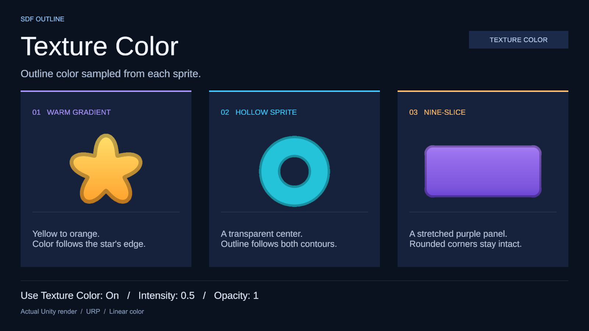
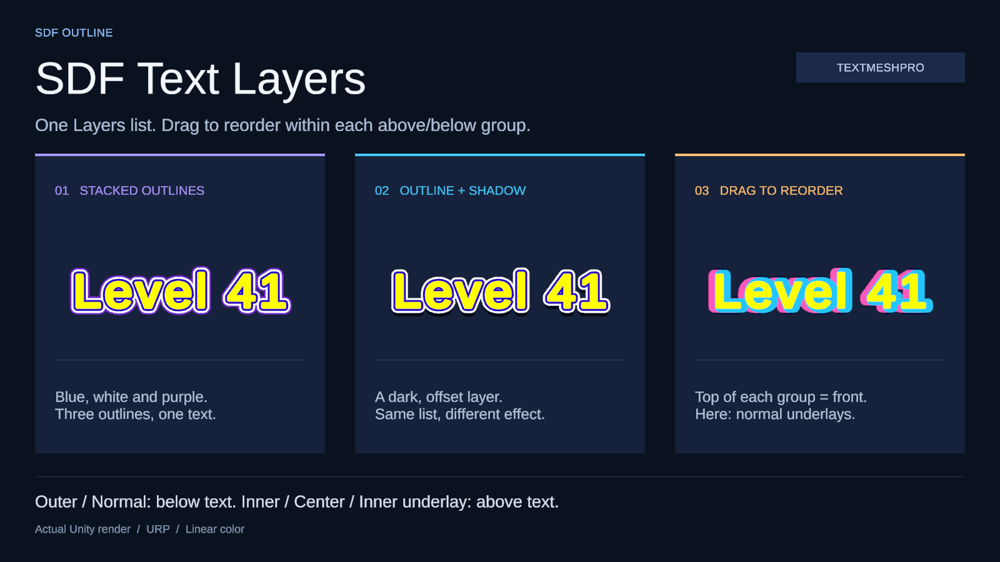
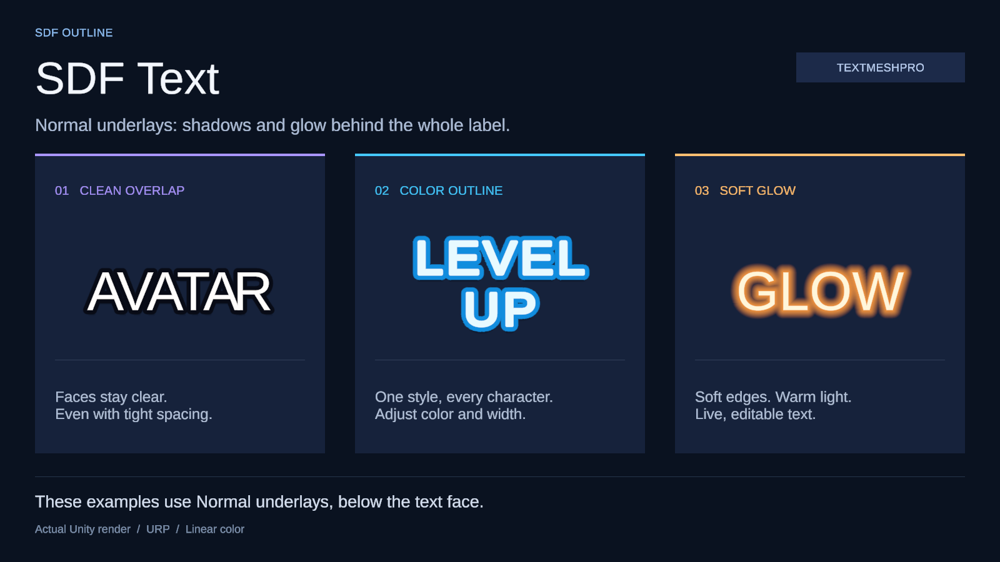
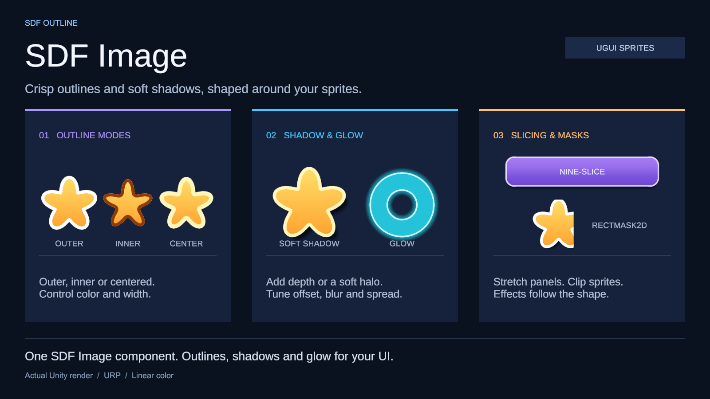

# SDF Image

Outlines and shadows for **Unity 6 / uGUI (Canvas)** sprites and TextMeshPro labels. This standalone library uses uGUI 2.0 and its bundled TextMeshPro.

## Quick start

1. Create **GameObject → UI → SDF Image**. It uses a single `SdfImage` component derived from `UnityEngine.UI.Image`.
2. Assign the original sprite to **Source Image** on this component.
3. If the sprite has no SDF yet, click **Generate SDF**. The image continues to display normally while baking.
4. Standard Unity Image properties appear directly in the Inspector: **Source Image**, **Color**, **Material**, Raycast, Maskable, Image Type and its related options. These controls are always available, without a separate group or waiting for generation.
5. After generation, edit **SDF Effects → Layers** in the component Inspector. Drag layers to reorder them; the top layer is in front. Bake controls are available in the source texture's **SDF Import Settings**.

Settings belong to the **source texture** and apply to every sprite in that texture. Assigning a regular sprite does not start a bake. Generation enables **Auto Update**, so later changes to the image, import settings or SDF settings trigger an update. You can change Auto Update in SDF Import Settings. The source texture's Inspector shows **Generate** until an SDF is available, then **Open SDF Import Settings**.

Clicking **Cancel** or disabling Auto Update cancels queued and running work and prevents new jobs. Completed results remain available. Disable individual layers to hide them, or turn off **Effects Enabled** to use the standard Image rendering path.

For each layer, enable **Use Texture Color** to use the texture's RGB for the effect. **Intensity** `0` produces black, `1` keeps the original color, and values above `1` make it brighter. **Opacity** controls the effect's alpha separately. When disabled, the layer uses **Color** and retains your settings. Existing SDF sprites do not need rebaking.



All three examples use **Intensity 0.5** and **Opacity 1**; the outline follows the texture colors along each sprite's edges.

The legacy `SdfAutoBake` component is retained so older prefabs still load. Image adopts its saved source; **Remove Legacy Auto Bake** in the Inspector removes the redundant helper with Undo support. New objects do not need this helper.

## TextMeshPro

1. Create **GameObject → UI → SDF Text**. The `SdfText` component derives from `TextMeshProUGUI` and keeps the standard TMP Inspector for content, font, font size, alignment, spacing, auto size and rich text.
2. Assign a TMP font with an SDF atlas. There is no need to Generate SDF or bake text into sprites.
3. Enable **Effects Enabled** in **SDF Effects** below the Inspector. Spread, softness and offset use Canvas local units.

Use **+** and **−** in **Layers** to add or remove effects, and drag the handles to reorder them. The top layer is in front, closest to the text; the last layer is at the back. Each layer has its own enable toggle, Color, Spread, Softness and Offset. **Effects Enabled** controls the whole list and retains its settings when disabled.



Positive **Spread** expands the glyph shape, zero keeps its size, and negative values contract it. **Softness** blurs the edge. Use a dark layer with an offset for a shadow, or a bright soft layer with zero offset for glow. Outlines, shadows and glow share the same list and follow its order.

**Softness 0** still uses antialiasing. Enlarged contours from low-resolution glyphs can remain rough; regenerate the font at a higher sampling size, with enough atlas space and padding for large labels and thick effects. Softness adds blur but cannot restore missing glyph detail.

Reordering requires a single selected label. You can edit shared layer settings across multiple labels, and add or remove layers together when their layer counts match.

All effect layers are drawn behind all glyph faces. A later character's outline cannot cover its neighbour's face, even with tight spacing, fallback fonts or multiple materials. The component uses TMP's current mesh and font atlas and updates automatically when content, layout or fonts change at runtime. TMP's built-in Outline/Underlay/Glow effects are disabled on separate render materials; source fonts and materials remain unchanged.

The material Inspector below **SDF Effects** edits the assigned TMP material preset, including Face Color, Softness and Dilate. Changes persist in that material and affect other labels sharing it. Choose a separate material preset for an independent style. Temporary render materials are hidden from the Inspector; use **SDF Effects** for outlines, shadows and glow.



These three examples use the same `SdfText` component: outline and shadow behind tightly spaced text, a colored outline on a multiline label, and glow from a shadow with no offset. The image was rendered directly in URP Linear. See the [tight-spacing checks and render report](VALIDATION.md).

For an existing TMP label, create an **SDF Text** label, assign its font, content and layout settings, then update references to the new component. Automatic conversion of existing TMP components is not provided; do not replace the TMP script directly in a scene or prefab.

`SdfText` can still be assigned to a `TMP_Text` or `TextMeshProUGUI` field. Continue using `text`, `SetText`, `font`, `fontSize` and the usual TMP APIs:

```csharp
using SDFUI;
using UnityEngine;

public sealed class ScoreLabel : MonoBehaviour
{
    [SerializeField] private SdfText label;

    private void Awake()
    {
        label.EffectsEnabled = true;
        label.Layers.Clear();
        label.Layers.Add(new SdfTextEffect { Color = Color.black, Width = 2 });
        label.Layers.Add(new SdfTextEffect
        {
            Color = new Color(0, 0, 0, 0.3f),
            Width = 0,
            Softness = 2,
            Offset = new Vector2(0, -3)
        });
        label.RefreshEffects();
    }

    public void SetScore(int score) => label.SetText("Score: {0}", score);
}
```

`Layers` exposes a mutable `List<SdfTextEffect>`. Each entry has `Enabled`, signed `Width` (shown as Spread in the Inspector), `Softness`, `Color` and `Offset` properties. `Spread` is an alias for `Width`. After adding, removing, reordering or editing entries from code, call `RefreshEffects()`.

Existing outline settings migrate in their current order, followed by the old shadow as the back layer, with its settings and enabled state preserved. New labels start with an enabled outline layer and a disabled shadow layer. The earlier `Outline*` and `Shadow*` properties remain compatibility aliases for their migrated layers, including after reordering; use `Layers` and `EffectsEnabled` for new code.

Unlike the old single-outline component, width zero now renders an unexpanded effect. This also applies to migrated width-zero outlines; disable the layer to hide it.

- Supports `TextMeshProUGUI` on a Canvas only. 3D `TextMeshPro` and custom font shaders that do not use SDF are not supported.
- Spread and softness are limited by the font atlas's existing padding and distance range. If an effect stops expanding, regenerate the font atlas with more padding; sprite bake settings do not affect fonts.
- Supports ancestor Canvases, `Mask`, `RectMask2D` and `CanvasGroup` in the hierarchy. Place `Canvas`, `Mask` and `RectMask2D` on a parent object. Attaching them directly to the text object disables SDF effects.
- Each active effect layer adds a render layer and material for each font material in use. More layers or fallback fonts increase draw calls, while large effects increase overdraw.

## Textures embedded in the source sprite

The padded color texture, distance texture and `SdfSprite` descriptor are subassets of the **source image file itself**. The descriptor is also attached directly to the Sprite through Unity 6's `Sprite.AddScriptableObject` API; `SdfSprite.FromSprite(source)` retrieves it in the player.

Expand the source image in the Project window and select **`<sprite name> SDF`** to open its import settings. This is the actual single-channel distance texture, with Unity's texture preview. The color texture and descriptor remain internal, and the original image stays the main asset. Expand **Imported Textures** to inspect both generated textures' dimensions and formats. **Open SDF Import Settings** on the source Inspector or SDF Image component opens the same entry.

The source Inspector has an **SDF** foldout below **Open Sprite Editor**, beside the native **Advanced** section. It shows status and one action: **Generate** before a bake exists, or **Open SDF Import Settings** once it is ready. All bake controls live in **SDF Import Settings**: Auto Update, Padding, Distance Range, Alpha Threshold and Compress Distance, followed by Unity's native **Default** and platform icon tabs. The entire platform compression panel is Unity's native Sprite Inspector: **Max Size**, **Resize Algorithm**, the full platform **Format** list, **Compression**, **Use Crunch Compression**, and format-specific quality and platform controls. Platform tabs follow installed build modules. Each platform can override the defaults independently. Use **Apply** to save changes or **Revert** to discard pending edits. Inactive platform overrides do not invalidate the current target's bake. These settings belong to SDF generation and do not change the original texture's platform settings.

**Clear SDF** in the import settings removes the generated textures and descriptor for every sprite in that source image, cancels any ongoing bake, and turns off Auto Update. The original image, Sprite references, and saved bake settings stay intact. The source Inspector returns to **Generate**. Clear supports Undo/Redo; local cache files may be reused when restoring or generating again.

No separate `.asset`, SDF PNG or baked-image folder is created in Assets. Temporary cache data lives in `Library/SDFImage` and does not need to be committed. Commit the source image, its `.meta` file and the library. On a new machine, Unity rebakes sources with SDF enabled during import. The original image file and its image import settings remain unchanged; SDF settings are added to `TextureImporter.userData` while preserving its existing contents.

`Image.sprite` keeps its reference to the original Sprite in the player to find the attached data. Baking does not run at runtime. Wait for Ready before building sources with Auto Update enabled. Build validation checks images in enabled scenes, Resources, preloaded assets and dependent prefabs. Sprites without generated SDF data use the standard Image renderer.

## Bounded, cancellable baking

- Downscales **before** calculating distances. Max Size defaults to 512 and uses Unity's native size choices. The total bake budget below still applies. Choose Bilinear or Mitchell to control downsampling. The source texture's dimensions are unchanged.
- Reads the GPU with `AsyncGPUReadback` and calculates distances on one worker in time linear to the pixel count. It does not perform synchronous GPU readback or wait for the worker on the main thread.
- Runs one job at a time. Changing settings cancels outdated results; only the current generation can be published.
- Caches by source, Sprite ID and settings. Reimporting valid data does not repeat the bake.
- Limits each texture to 128 sprites or 4 million texels after padding. Exceeding either limit reports an error asking you to reduce Max Size or padding before allocating large bake buffers.
- The main thread still creates GPU resources and publishes subassets through Unity's import process, which may briefly stall depending on the machine. There is no guarantee of zero stalls or any unmeasured frame rate.

The Editor needs a graphics device that supports AsyncGPUReadback. Running with `-nographics` cannot generate new SDF data. The GPU is used only to read the imported image, including its alpha and import settings; the source does not need Read/Write enabled.

## Effects and limitations

- **SDF Effects → Layers** is a reorderable list, matching SDF Text: the top entry is in front. Each Image supports up to **16 layers**, with independent enable, color, width/spread, softness and offset. **Effects Enabled** toggles the entire list without losing its settings.
- Each layer supports **Outer**, **Inner** or **Center** outlines. **Underlay** fills the silhouette behind the sprite for shadows and glow; positive Spread expands it and negative Spread contracts it. Exterior effects stay behind the sprite; inner outlines tint its inner edge.
- Each layer has its own **Use Texture Color** and **Intensity**. This replaces layer RGB with texture RGB × Intensity, without multiplying by layer Color or Image Color RGB. Alpha still uses the layer Color/Opacity and overall Image alpha. Intensity does not change alpha.
- Existing outline and shadow settings migrate into two layers. Released scalar APIs and legacy animation/prefab overrides follow their original layers after reordering. Clearing the list remains intentional.
- Retains the source artwork and transparency for the fill, subject to the selected color compression. `Graphic.color` tints the fill, while its alpha fades the entire image and effects once.
- Supports Simple, preserve aspect, nine-slice, layout and native size. The quad expands to avoid clipping outlines and shadows.
- Supports `Mask`, `RectMask2D` including softness, and `CanvasGroup`. Raycasts still use the original RectTransform.
- SDF Image supports Simple and Sliced with Fill Center enabled. Filled/radial fill, Tiled and Sliced with Fill Center disabled use the standard Unity Image renderer without SDF effects. Text is supported through `SdfText` as described above. SpriteRenderer, UI Toolkit and Coffee SoftMask/UIEffect are not integrated.

Width, softness, offset, blur and spread use **Canvas local units**. Padding and Distance Range use **pixels of the downscaled SDF image**. The shader limits effects to the available padding and distance range; increase both if an outline stops expanding. Shadow offset is independent of the distance limit. Canvas and object transforms scale the effects too.

The field stores signed distances, positive inside the shape. The algorithm calculates the Euclidean distance to the opposite alpha class with a half-pixel correction. Alpha Threshold defines the boundary. Compressed storage normalizes these distances into a linear single-channel texture; the shader decodes them back to source pixels. This is a raster SDF, not vector reconstruction or MSDF; increasing Max Size helps preserve fine details.

Each image uses one quad and one material draw, compositing its layers before applying Graphic/CanvasGroup alpha once. It does not batch with images using other materials. The shader samples the fill once, distance once per visible layer, and color once more for each texture-colored layer. More layers increase fragment work; large offsets and soft effects increase the covered area. Multiple images using the same Sprite share its baked textures, and editing layers does not rebake them. The first 16 list entries are supported; entries beyond this limit are not rendered.

### Baked texture memory and compression

**SDF Import Settings** uses Unity's native Sprite compression controls and texture encoder. **Automatic** chooses a format from the platform and compression quality; a platform override exposes the same complete Format list as a normal Sprite, including applicable Crunch formats. The native controls show compressor quality and platform-specific options when relevant. Existing bake settings are retained when opening the Inspector.

The native platform controls encode the padded **color** texture. **Compress Distance**, enabled by default, separately stores the distance map as **BC4** on desktop or **EAC R** on Android/iOS/tvOS (4 bits per texel), with **R8** on other targets. Each distance dimension is rounded up to a power of two by adding outside-of-shape texels at the top and right. This does not resize the artwork, move the sprite or change its usable effect padding. For example, a 400×400 sprite with padding 32 keeps its 464×464 field inside a 512×512 compressed texture. Color and distance use independent texture coordinates, so color formats and sprite slicing remain aligned.

Disable **Compress Distance** to keep the original, uncompressed **RHalf (2 bytes per texel)** field and its exact padded dimensions. Compression is lossy; large Distance Range values or extreme magnification can expose contour errors. Both generated textures have no mipmaps and release their CPU-readable pixel copies. This does not change the original texture's format or Read/Write setting. Use GPU readback if tooling needs to inspect generated pixels. Older RHalf descriptors remain supported without changing existing object references.

For a 400×400 sprite with padding 32 and BC7 color, the compressed distance map uses **128 KiB**, compared with **420.5 KiB** for RHalf. Together with the 464×464 color texture, the two baked textures use approximately **338 KiB of GPU pixel data**, compared with **631 KiB** with RHalf distance storage. These figures exclude the original texture, object overhead and any platform fallback. Editor memory reports can include extra texture data; measure a player build for runtime memory. This change does not optimize TMP font atlases or draw-call batching.

Compression is lossy for the color artwork, including alpha and texture-colored outlines. Select **Compression: None** or **RGBA 32 bit** for exact baked colors; it still releases the CPU copies. RGB-only formats discard alpha, as they do for ordinary sprites. Crunch reduces stored data rather than GPU memory. Color textures receive unused right/top padding as required by the selected block format (or square power-of-two padding for PVRTC), without stretching the image or changing its pivot, borders or native size. Unsupported target GPUs may decompress textures and use more memory; validate your target devices. Lower Maximum Size and keep Padding only as large as your effects require to reduce memory further.

## API

```csharp
using SDFUI;
using UnityEngine;

public sealed class ButtonStyle : MonoBehaviour
{
    [SerializeField] private SdfImage image;
    [SerializeField] private Sprite icon; // SDF generated in the Editor.

    private void Awake()
    {
        image.sprite = icon; // Standard Image API; overrideSprite is also supported.
        image.OutlineEnabled = true;
        image.OutlineWidth = 4;
        image.OutlineColor = Color.white;
        image.OutlinePosition = SdfOutlinePosition.Outer;
        image.ShadowEnabled = true;
        image.ShadowColor = new Color(0, 0, 0, 0.35f);
        image.ShadowOffset = new Vector2(0, -6);
        image.ShadowBlur = 10;
    }
}
```

`SdfImage` derives from `Image` and can be assigned to a `UnityEngine.UI.Image` field or a Button's Target Graphic. `image.sprite` and `image.overrideSprite` automatically find the matching SDF data, including when switching sprites within one sheet. The legacy `image.Sprite` API accepting `SdfSprite` remains for compatibility; new code should use `image.sprite` and `image.SdfData`. For Buttons, enable Raycast Target; the Canvas needs a GraphicRaycaster and EventSystem as usual for uGUI.

To color the outline from the texture, set `image.OutlineUseTextureColor = true` and `image.OutlineTextureColorIntensity = 1f`. This mode is disabled by default; intensity defaults to `1` and accepts values of `0` or greater. `image.OutlineColor.a` still controls opacity; `Image.color` RGB only tints the fill.

For multiple effects, edit the list and call `RefreshEffects()` after changing entries or their order:

```csharp
image.Layers.Clear();
image.Layers.Add(new SdfImageEffect { Width = 3, Color = Color.blue });
image.Layers.Add(new SdfImageEffect { Width = 8, Color = Color.white });
image.Layers.Add(new SdfImageEffect {
    Position = SdfOutlinePosition.Underlay,
    Spread = 8, Softness = 4, Offset = new Vector2(3, -5),
    Color = new Color(0, 0, 0, 0.5f)
});
image.RefreshEffects();
```

## Demo, installation and testing

**Tools → SDF Image → Create Demo Prefab** creates a separate sample in `Assets/SDFImageDemo`, with three source images that have SDF enabled and a prefab demonstrating outlines, shadows, glow, Sliced and RectMask2D. Wait for Ready, then drag the prefab into an empty scene. The command does not modify the open scene.



For UPM installations, import the **Outline and Shadow Demo** sample through Package Manager to try outlines, shadows, glow, nine-slice and RectMask2D. The `Samples~` folder is not imported automatically when copying the library into Assets.

In Package Manager, choose **Install package from Git URL** and enter:

```text
https://github.com/phucnguyen752/sdf-image.git#upm
```

This URL follows the `upm` branch. After each release, select **SDF Image** in Package Manager and click **Update**; keep the same URL and let Package Manager update the version. If you installed a tag such as `#0.3.1`, use **Install package from Git URL** once with the `#upm` URL above to switch to this update flow. See [Unity's Git package update instructions](https://docs.unity3d.com/6000.0/Documentation/Manual/upm-ui-update.html).

To keep this version, use `https://github.com/phucnguyen752/sdf-image.git#0.7.0`. Clicking **Update** while using this tag will not switch to a newer release tag.

The `upm` branch and version tags contain the `com.sdfimage.ugui` package at the repository root; no `?path=` is needed. The `main` branch contains the full Unity project, with the library in `Assets/SDFImage`. Keep `#upm` in the URL because the default `main` branch does not have a package at its root.

You can also copy `Assets/SDFImage` with its `.meta` files into a Unity 6 project with uGUI 2.0, or keep a copy outside Assets and use Package Manager → Add package from disk with `package.json`. Keep only one installation. Source textures must be in Assets to save settings and import attached data. Shaders in Resources are included in builds. See [Publishing.md](Documentation~/Publishing.md) for the release workflow.

Namespaces and assemblies use `SDFUI`, `SDFUI.Editor` and `SDFUI.Tests.Editor`. When updating from version 0.2, update namespaces in your code and the package ID in the manifest; preserve script `.meta` files so existing components retain their identities. Move source settings and baked-data references together with the library. The component icon is a 64×64 PNG exported from the [source SVG](Documentation~/SdfImage.svg).

Run `SDFUI.Tests` in Window → General → Test Runner → EditMode. For UPM installations, add the package to `testables` in the manifest and install Unity Test Framework. `SdfTextTests` requires **Window → TextMeshPro → Import TMP Essential Resources**; text rendering checks are skipped when the sample font or a GPU is unavailable. See [VALIDATION.md](VALIDATION.md) for recorded test results and limitations.

Reference: [SDF Image – Quality UI Outlines and Shadow](https://marketplace.unity.com/packages/tools/gui/sdf-image-quality-ui-outlines-and-shadow-244942). This is an independent implementation with the scope described above.
